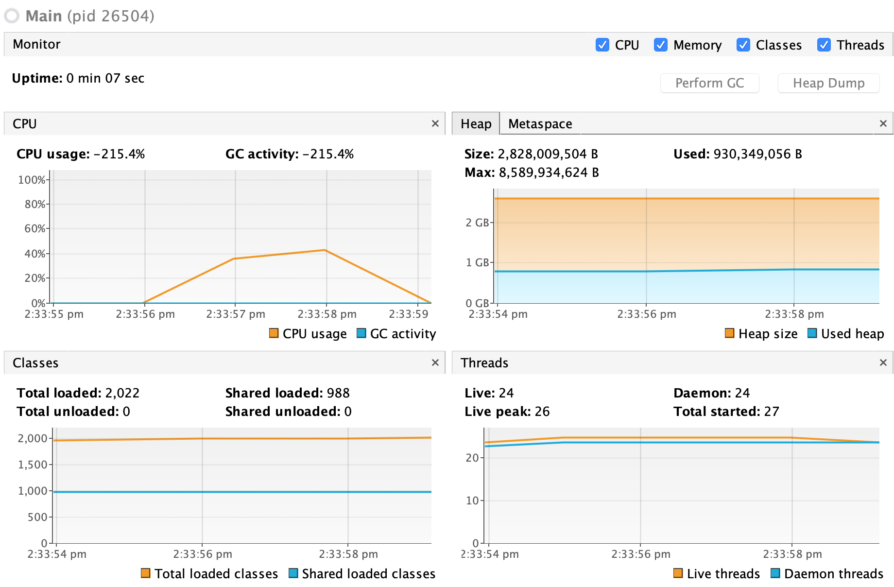
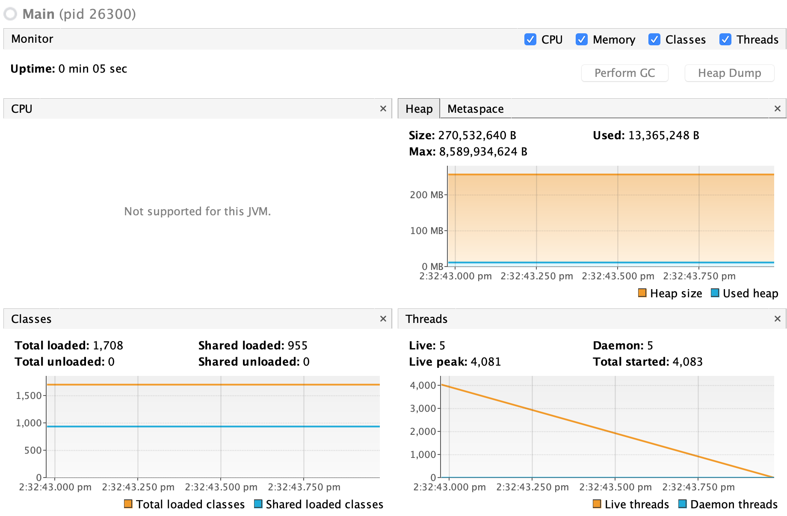

# Some Performance Test for Project Loom
This repo is created to collect the simple PoC we created for Project Loom
The JDK version we ran is JDK 13.

### Performance Monitor & Memory Usage:

With Project Loom Fibers:

Memory Usage is 930M and CPU peaked at ~40%. 27 system threads created and completed in 7s.

With Java Thread:

The JVM crashed after created 4k threads.
